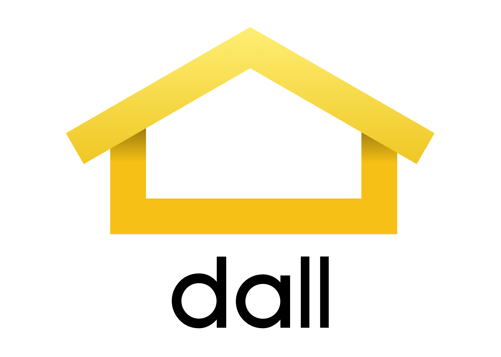

# What is dall?
dall is a tool to scrap ads from [daft.ie](https://daft.ie/) and summarize them in a Google Sheet Document. It is useful to manage and keep up-to-date ads from the site.

It is made using Java and Spring.